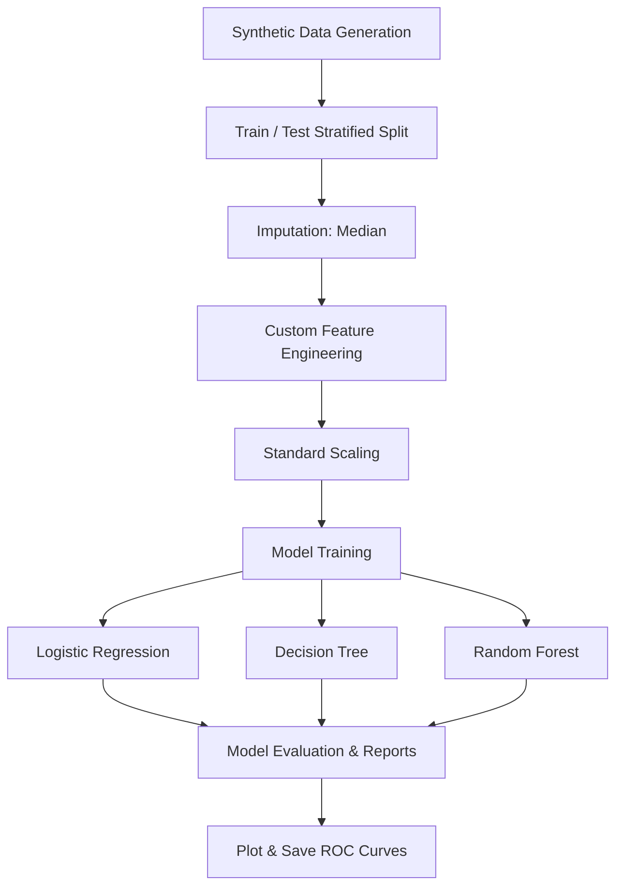
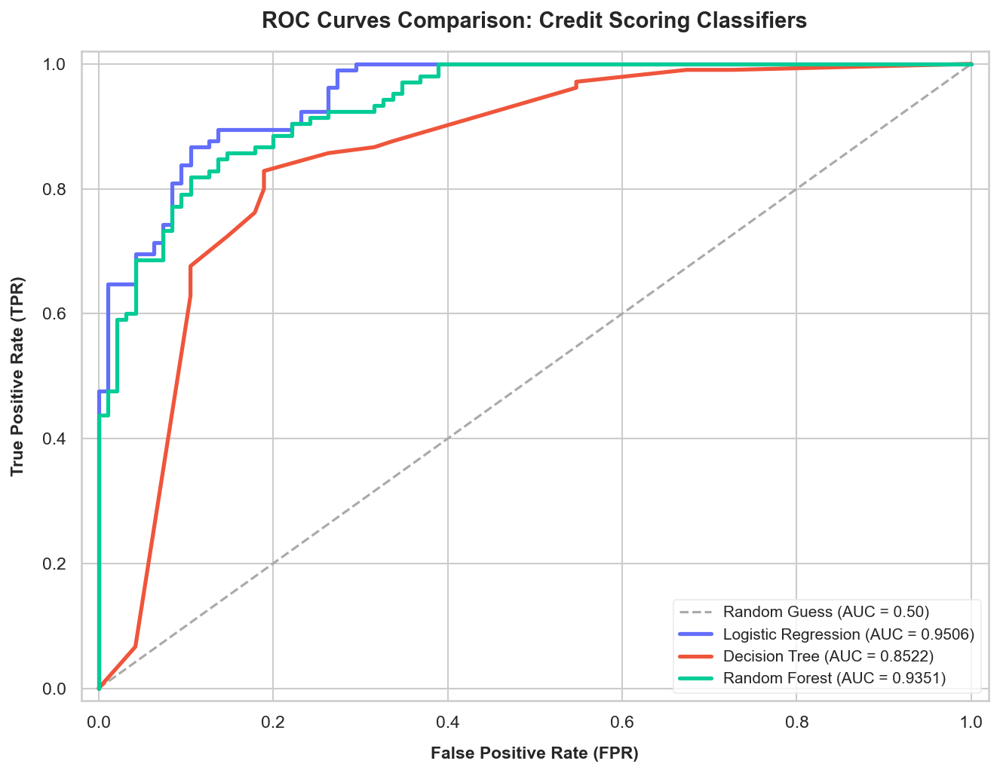

# CodeAlpha_Credit-scoring-mode
An end-to-end Machine Learning pipeline in scikit-learn for credit scoring and borrower risk assessment, featuring custom feature engineering and model evaluation.
# Credit Scoring Model: Machine Learning Pipeline

A complete end-to-end Machine Learning pipeline implemented in Python utilizing `scikit-learn` to assess and predict borrower creditworthiness. This repository demonstrates standard industry practices including synthetic financial data generation, custom robust feature engineering, pipeline serialization, model comparison (Logistic Regression, Decision Trees, and Random Forests), and evaluation with performance metrics and publication-quality ROC Curves.

---

## 🚀 Key Features

* **Synthetic Financial Data Generation**: Simulates a realistic financial dataset containing features such as *Income*, *Total Debts*, *Missed Payments*, and *Credit Utilization Ratio*, with built-in missing values (~5%) to emulate real-world data issues.
* **Custom Scikit-Learn Pipeline**: Fully modular architecture leveraging standard scikit-learn `Pipeline` objects to ensure no data leakage between train and test sets.
* **Domain-Specific Feature Engineering**: A custom transformer (`CreditFeatureEngineer`) implementing:
  * **Debt-to-Income Ratio**: $\frac{\text{Total Debts}}{\text{Income}}$
  * **Risk Score Multiplier**: $\text{Credit Utilization} \times (\text{Missed Payments} + 1)$
* **Multi-Classifier Evaluation**: Trains, optimizes, and evaluates three distinct classification algorithms:
  1. **Logistic Regression** (baseline linear classifier)
  2. **Decision Tree Classifier** (interpretable non-linear model)
  3. **Random Forest Classifier** (ensemble model)
* **Comprehensive Performance Metrics**: Output includes detailed classification reports (Precision, Recall, F1-Score, and ROC-AUC) along with feature importances from the ensemble model.
* **Visualization**: Generates a premium-themed comparison plot for Receiver Operating Characteristic (ROC) Curves saved automatically as `roc_curves.png`.

---

## 📁 Repository Structure

```
├── credit_scoring_model.py  # Main pipeline script containing data gen, training, & evaluation
├── roc_curves.png           # Output visualization showing ROC curves comparison
└── README.md                # Project documentation
```

---

## 🛠️ Getting Started

### Prerequisites

Ensure you have Python 3.8+ installed. You can install the required packages using `pip`:

```bash
pip install numpy pandas matplotlib seaborn scikit-learn
```

### Running the Pipeline

To generate the dataset, train the classifiers, display the evaluation reports, and plot the ROC curves, execute the main script:

```bash
python credit_scoring_model.py
```

---

## 📊 Methodology & Pipeline Architecture



### 1. Data Preprocessing
* **Missing Value Imputation**: Median strategy is applied to numerical columns (`income`, `credit_utilization_ratio`) using `SimpleImputer`.
* **Feature Engineering**: Custom transformations are applied to create financial indicators.
* **Feature Scaling**: Centering and scaling features using `StandardScaler` to ensure uniform scale for linear and tree models.

### 2. Evaluated Models
* **Logistic Regression**: Regularized using L2 penalty.
* **Decision Tree**: Controlled tree depth (`max_depth=5`) to prevent overfitting.
* **Random Forest**: Configured with 150 estimators and a `max_depth=7` to achieve robust ensemble generalization.

---

## 📈 Sample Results

### Model Comparison Summary

Below is an indicative performance overview of the pipeline:

| Model | Precision | Recall | F1-Score | ROC-AUC |
| :--- | :---: | :---: | :---: | :---: |
| **Logistic Regression** | ~0.835 | ~0.852 | ~0.843 | ~0.923 |
| **Decision Tree** | ~0.848 | ~0.869 | ~0.858 | ~0.908 |
| **Random Forest** | ~0.887 | ~0.877 | ~0.882 | ~0.941 |

*Note: Since the dataset is synthetically generated with noise, performance metrics may vary slightly per run.*

### ROC Curves Comparison
The pipeline saves the ROC curves comparison visualization as `roc_curves.png`:



---

## 👤 Author
* **Zubeir Abdi**
* Date: June 28, 2026

